# Arquitectura de la Base de Datos (SaaS Multi-Tenant)

Diseño de base de datos relacional altamente optimizado y securizado sobre **PostgreSQL 17** para una plataforma SaaS multi-tenant de gestión de restaurantes (Punto de Venta, Inventario y Facturación Electrónica SUNAT).

---

## 🏗️ Diagrama de Módulos del Sistema

```mermaid
graph TD
    subgraph SaaS_Billing["1. Core SaaS & Facturación"]
        planes["planes"] --> planes_periodos["planes_periodos"]
        empresas["empresas"] --> suscripciones["suscripciones"]
        suscripciones --> pagos["pagos"]
    end

    subgraph Identity_Auth["2. Identidad y Accesos (RBAC)"]
        usuarios["usuarios"] --> usuario_roles["usuario_roles"]
        roles["roles"] --> rol_permisos["rol_permisos"]
        permisos["permisos"]
        usuarios --> sesiones["sesiones"] --> session_events["session_events"]
    end

    subgraph Store_Menu["3. Configuración y Catálogo"]
        configuracion_empresa["configuracion_empresa"]
        categorias_menu["categorias_menu"] --> productos["productos"]
        productos --> producto_sucursales["producto_sucursales (Precios)"]
        productos --> stock_sucursal["stock_sucursal (Inventario)"]
    end

    subgraph POS_Operations["4. Operaciones en Sucursal (POS)"]
        sucursales["sucursales"] --> usuario_sucursales["usuario_sucursales"]
        ordenes["ordenes"] --> items_orden["items_orden"]
        aperturas_caja["aperturas_caja"] --> movimientos_caja["movimientos_caja"]
        ordenes --> pagos_orden["pagos_orden"]
    end

    subgraph SUNAT_Billing["5. Facturación Electrónica SUNAT"]
        comprobantes["comprobantes"] --> comprobante_detalles["comprobante_detalles"]
        comprobantes --> envios_sunat["envios_sunat"]
        comprobantes --> ordenes_comprobantes["ordenes_comprobantes"]
        comprobantes --> notas_credito["notas_credito"] --> notas_credito_detalles["notas_credito_detalles"]
        comprobantes --> notas_debito["notas_debito"] --> notas_debito_detalles["notas_debito_detalles"]
        series_comprobante["series_comprobante"]
        credenciales_sunat["credenciales_sunat"]
        clientes["clientes"]
    end

    empresas -.-> |Tenant ID| pagos
    empresas -.-> |Tenant ID| usuarios
    empresas -.-> |Tenant ID| sucursales
    empresas -.-> |Tenant ID| productos
    empresas -.-> |Tenant ID| ordenes
    empresas -.-> |Tenant ID| comprobantes
```

---

## 🗃️ Detalle de Tablas por Módulo

### 1. Módulo Core SaaS (Suscripciones y Facturación)
Administra los planes de suscripción, periodos comerciales, inquilinos (empresas/tenants) y transacciones de cobro de la plataforma.

| Tabla | Propósito | Tipo PK | Columnas Clave / FKs | RLS |
| :--- | :--- | :--- | :--- | :--- |
| **`planes`** | Catálogo de planes disponibles (ej. Básico, Premium). | `SERIAL` | `limite_sucursales`, `limite_usuarios`, `limite_productos`, `precio_mensual` | No |
| **`planes_periodos`** | Descuentos aplicados según meses de suscripción. | `SERIAL` | `id_plan` (FK `planes`), `meses`, `descuento_porcentaje` | No |
| **`estados_empresa`** | Estados operativos de una empresa (ej. Activo, Suspendido). | `SERIAL` | `nombre` (VARCHAR UNIQUE) | No |
| **`empresas`** | Registro principal de cada tenant (inquilino). | `UUID` | `id_plan` (FK `planes`), `id_estado_empresa` (FK `estados_empresa`), `slug` (UNIQUE), `id_tipo_documento_fiscal` (FK), `numero_documento_fiscal` | No |
| **`estados_suscripcion`**| Estados de vigencia (ej. Pendiente, Activo, Vencido). | `SERIAL` | `nombre` (VARCHAR UNIQUE) | No |
| **`suscripciones`** | Contratos de suscripción vigentes por empresa. | `UUID` | `id_empresa` (FK `empresas`), `id_plan` (FK), `id_periodo` (FK), `precio_pagado`, `fecha_inicio`, `fecha_fin` | No |
| **`estados_pago`** | Estados de facturación (ej. Pendiente, Completado, Fallido). | `SERIAL` | `nombre` (VARCHAR UNIQUE) | No |
| **`metodos_pago`** | Catálogo de métodos de pago soportados (ej. Efectivo, Tarjeta). | `SERIAL` | `nombre` (VARCHAR UNIQUE) | No |
| **`pagos`** | Registro de cobros de suscripciones SaaS. | `UUID` | `id_empresa` (FK), `id_suscripcion` (FK), `monto_pagado`, `id_metodo_pago` (FK), `id_estado_pago` (FK) | **Sí** |

---

### 2. Módulo de Identidad y Accesos (RBAC & Sesiones)
Controla la autenticación, los roles, permisos de usuarios y logs de sesiones activas.

| Tabla | Propósito | Tipo PK | Columnas Clave / FKs | RLS |
| :--- | :--- | :--- | :--- | :--- |
| **`roles`** | Roles de seguridad del sistema (ej. Administrador, Cajero). | `SERIAL` | `nombre` (VARCHAR UNIQUE) | No |
| **`permisos`** | Permisos granulares de acceso a endpoints o vistas. | `SERIAL` | `nombre` (VARCHAR UNIQUE) | No |
| **`rol_permisos`** | Relación N:M entre roles y permisos. | Compuesta | `(id_rol, id_permiso)` (FKs) | No |
| **`usuarios`** | Usuarios del sistema (globales y operativos). | `UUID` | `id_empresa` (FK `empresas` NULLable), `email` (UNIQUE), `contrasena_hash`, `scope` (`global` / `operativo`) | **Sí** |
| **`usuario_roles`** | Roles asignados a los usuarios. | Compuesta | `(id_usuario, id_rol)` (FKs) | **Sí** |
| **`sesiones`** | Manejo de sesiones activas y Refresh Tokens. | `UUID` | `id_usuario` (FK), `refresh_token_hash`, `expira_en`, `revocado` | **Sí** |
| **`session_events`** | Auditoría y trazas de eventos de inicio/cierre de sesión. | `UUID` | `id_sesion` (FK), `id_usuario` (FK), `evento` (`created`, `revoked`), `ip_address` | **Sí** |

---

### 3. Módulo de Configuración y Menú (Productos e Inventario)
Estructura la parametrización de cada tienda, categorías del menú y catálogo de productos con stock multisucursal.

| Tabla | Propósito | Tipo PK | Columnas Clave / FKs | RLS |
| :--- | :--- | :--- | :--- | :--- |
| **`configuracion_empresa`**| Parámetros generales del tenant (moneda, zona horaria). | `UUID` | `id_empresa` (FK), `moneda_defecto`, `facturacion_electronica_habilitada` | **Sí** |
| **`categorias_menu`** | Clasificación de productos (ej. Bebidas, Pizzas). | `UUID` | `id_empresa` (FK), `nombre`, `activo` | **Sí** |
| **`productos`** | Catálogo de platos, bebidas y artículos de venta. | `UUID` | `id_empresa` (FK), `id_categoria` (FK), `nombre`, `precio_venta` (CHECK >= 0), `precio_costo` (CHECK >= 0), `activo` | **Sí** |
| **`producto_sucursales`** | Precios de venta específicos por sucursal. | Compuesta | `(id_producto, id_sucursal)` (FKs), `id_empresa` (FK), `precio_venta` | **Sí** |
| **`stock_sucursal`** | Control de inventario y stock físico por sucursal. | Compuesta | `(id_producto, id_sucursal)` (FKs), `id_empresa` (FK), `stock` (DECIMAL) | **Sí** |

---

### 4. Módulo POS (Operaciones y Ventas)
Registra las sucursales, apertura y cierres de cajas, órdenes de comida y flujos de cobro diario.

| Tabla | Propósito | Tipo PK | Columnas Clave / FKs | RLS |
| :--- | :--- | :--- | :--- | :--- |
| **`sucursales`** | Locales físicos del restaurante. | `UUID` | `id_empresa` (FK), `nombre`, `activo` | **Sí** |
| **`usuario_sucursales`** | Relación N:M de asignación de personal a locales. | Compuesta | `(id_usuario, id_sucursal)` (FKs) | No |
| **`estados_orden`** | Estados de pedidos (ej. Pendiente, Preparando, Entregado). | `SERIAL` | `nombre` (VARCHAR UNIQUE) | No |
| **`tipos_orden`** | Formatos de ordenes (ej. mesa, delivery, recojo, qr). | `SERIAL` | `codigo` (VARCHAR UNIQUE) | No |
| **`ordenes`** | Pedidos y cuentas registradas en las mesas. | `UUID` | `id_empresa` (FK), `id_sucursal` (FK), `numero_orden` (BIGINT), `id_tipo_orden` (FK), `id_estado_orden` (FK), `id_usuario` (FK) | **Sí** |
| **`items_orden`** | Líneas de detalle de cada pedido. | `UUID` | `id_orden` (FK), `id_producto` (FK), `cantidad`, `precio_unitario`, `subtotal`, `nombre_producto_snapshot` | **Sí** |
| **`secuencias_empresa`** | Contador secuencial atómico de órdenes por tenant. | Compuesta | `id_empresa` (PK), `ultimo_numero_orden` (BIGINT) | No |
| **`estados_caja`** | Estados de caja operativa (ej. Abierta, Cerrada). | `SERIAL` | `nombre` (VARCHAR UNIQUE) | No |
| **`tipos_movimiento_caja`**| Conceptos de flujo (ej. Ingreso, Egreso, Arqueo). | `SERIAL` | `nombre` (VARCHAR UNIQUE) | No |
| **`aperturas_caja`** | Turnos y arqueos de dinero por caja y sucursal. | `UUID` | `id_empresa` (FK), `id_sucursal` (FK), `id_usuario` (FK), `id_estado` (FK), `monto_apertura`, `monto_cierre_real` | **Sí** |
| **`movimientos_caja`** | Transacciones de entrada/salida de dinero de la caja. | `UUID` | `id_apertura_caja` (FK), `id_tipo_movimiento` (FK), `monto` | **Sí** |
| **`pagos_orden`** | Transacciones de pago de las comandas del cliente. | `UUID` | `id_orden` (FK), `id_empresa` (FK), `id_sucursal` (FK), `monto_pagado`, `monto_recibido`, `vuelto`, `id_metodo_pago` (FK), `id_estado_pago` (FK) | **Sí** |

---

### 5. Módulo de Facturación Electrónica SUNAT
Gestiona la emisión de Facturas, Boletas, Notas de Crédito, Notas de Débito y la comunicación SOAP/REST con SUNAT.

| Tabla | Propósito | Tipo PK | Columnas Clave / FKs | RLS |
| :--- | :--- | :--- | :--- | :--- |
| **`tipos_documento_fiscal`**| Documentos de identidad (ej. RUC, DNI, Pasaporte). | `SERIAL` | `codigo` (VARCHAR UNIQUE) | No |
| **`clientes`** | Directorio de clientes del restaurante para facturación. | `UUID` | `id_empresa` (FK), `id_tipo_documento_fiscal` (FK), `numero_documento`, `nombre_o_razon_social` | **Sí** |
| **`credenciales_sunat`** | Claves SOL y certificado digital por tenant. | Compuesta | `id_empresa` (PK), `ruc`, `usuario_sol`, `clave_sol`, `certificado_digital` | **Sí** |
| **`tipos_comprobante`** | Catálogo SUNAT (01 Factura, 03 Boleta, 99 Nota Venta). | `SERIAL` | `code` (VARCHAR UNIQUE) | No |
| **`estados_comprobante`**| Estados SUNAT (borrador, emitido, aceptado, rechazado, anulado).| `SERIAL` | `nombre` (VARCHAR UNIQUE) | No |
| **`estados_operacionales`**| Estados locales de facturación (pendiente_caja, conciliada).| `SERIAL` | `nombre` (VARCHAR UNIQUE) | No |
| **`series_comprobante`** | Series de facturación asignadas por sucursal. | `SERIAL` | `id_empresa` (FK), `id_sucursal` (FK), `id_tipo_comprobante` (FK), `serie` (VARCHAR4), `ultimo_correlativo` | **Sí** |
| **`comprobantes`** | Cabecera inmutable de facturas y boletas. | `UUID` | `id_empresa` (FK), `id_sucursal` (FK), `id_orden` (FK), `id_tipo_comprobante` (FK), `id_estado` (FK), `id_estado_operacional` (FK), `serie`, `numero`, `monto_total` | **Sí** |
| **`comprobante_detalles`** | Detalle inmutable de líneas de facturación. | `UUID` | `id_comprobante` (FK), `id_producto` (FK), `nombre_producto`, `cantidad`, `subtotal`, `igv` | **Sí** |
| **`ordenes_comprobantes`** | Tabla puente N:M para relacionar órdenes y comprobantes. | Compuesta | `(id_orden, id_comprobante)` (FKs) | **Sí** |
| **`envios_sunat`** | Registro append-only de intentos de envío y XML CDRs. | `UUID` | `id_comprobante` (FK), `http_status`, `response_code`, `raw_cdr`, `idempotency_key` | **Sí** |
| **`motivos_nota_credito`**| Catálogo de motivos de anulación/descuento de SUNAT. | `SERIAL` | `code` (VARCHAR UNIQUE) | No |
| **`motivos_nota_debito`** | Catálogo de motivos de penalización/intereses de SUNAT. | `SERIAL` | `code` (VARCHAR UNIQUE) | No |
| **`estados_nota`** | Estados del flujo de notas fiscales (borrador, aceptado).| `SERIAL` | `nombre` (VARCHAR UNIQUE) | No |
| **`notas_credito`** | Cabecera inmutable de Notas de Crédito emitidas. | `UUID` | `id_empresa` (FK), `id_sucursal` (FK), `id_comprobante` (FK), `id_motivo` (FK), `serie`, `numero`, `monto_total` | **Sí** |
| **`notas_credito_detalles`**| Detalle inmutable de ítems de Notas de Crédito. | `UUID` | `id_nota` (FK), `nombre_producto`, `subtotal`, `igv` | **Sí** |
| **`notas_debito`** | Cabecera inmutable de Notas de Débito emitidas. | `UUID` | `id_empresa` (FK), `id_sucursal` (FK), `id_comprobante` (FK), `id_motivo` (FK), `serie`, `numero`, `monto_total` | **Sí** |
| **`notas_debito_detalles`** | Detalle inmutable de ítems de Notas de Débito. | `UUID` | `id_nota` (FK), `nombre_producto`, `subtotal`, `igv` | **Sí** |

---

### 6. Módulo de Auditoría (Logs Globales)
Registra las transacciones e historial de modificaciones críticas a nivel relacional de forma altamente escalable.

| Tabla | Propósito | Tipo PK | Columnas Clave / FKs | RLS |
| :--- | :--- | :--- | :--- | :--- |
| **`registros_auditoria`** | Log histórico de cambios (INSERT/UPDATE/DELETE). Particionada mensualmente. | Compuesta `(id_auditoria, creado_en)` | `id_empresa` (FK), `id_usuario` (FK), `tabla_afectada`, `operacion` (ENUM), `datos_anteriores`, `datos_nuevos`, `datos_modificados` (JSONB deltas), `creado_en` (partición) | **Sí** |

---

## 🔒 Seguridad e Integridad Relacional (RLS & Triggers)

1. **Aislamiento Multi-Tenant (Row Level Security):**
   * El RLS está activado en todas las tablas operacionales que almacenan datos del cliente (`id_empresa`).
   * La validación se ejecuta en cada consulta a través del parámetro de sesión `app.id_empresa`. El middleware de Go ejecuta `SET LOCAL app.id_empresa = '<uuid>'` dentro del bloque transaccional. Las tablas hijas se protegen mediante subconsultas `EXISTS` cruzadas o comparación directa (RLS Denormalizado para performance).

2. **Inmutabilidad Fiscal Absoluta:**
   * Las tablas operacionales de SUNAT (`comprobante_detalles`, `notas_credito_detalles`, `notas_debito_detalles`) tienen triggers activos que bloquean sentencias `UPDATE` and `DELETE` (`RAISE EXCEPTION`).
   * La cabecera `comprobantes` tiene un trigger de inmutabilidad (`trg_comprobantes_header_immutable`) que congela permanentemente las columnas de montos, series, correlativos y fechas una vez que el estado del documento deja de ser `borrador`.

3. **Consistencia de Caja y Finanzas (Estrategia de Consolidación):**
   * La base de datos valida automáticamente que no existan montos negativos en precios de venta, costo, stock ni transacciones mediante check constraints (`>= 0`).
   * Se elimina el trigger que sumaba movimientos en cada insert de caja, reemplazándose por la vista materializada `caja_saldos`, la cual está optimizada para **excluir cajas cerradas**.
   * Al momento de hacer el cierre de turno, el backend en Go calcula el saldo final y lo consolida físicamente en la columna `monto_cierre` de `aperturas_caja` marcando el registro como inmutable. 
   * Las consultas de saldos leen de la vista unificada `v_caja_saldos`, la cual combina el histórico indexado fijo (cajas cerradas) con la vista materializada liviana de cajas activas (abiertas), garantizando un rendimiento óptimo de I/O y CPU.
   * La tabla `pagos_orden` cuenta con validaciones matemáticas integradas a nivel de base de datos que exigen que el vuelto devuelto al cliente coincida exactamente con la diferencia entre el monto recibido y el monto cobrado.

4. **Optimización de Auditoría (Particionamiento y Deltas):**
   * La tabla `registros_auditoria` está **particionada mensualmente por rango de fecha** (`PARTITION BY RANGE (creado_en)`), lo que permite purgar datos históricos antiguos de forma instantánea usando `DROP TABLE` sin bloquear la base de datos ni generar fragmentación.
   * Se implementa un **cálculo de deltas mínimo con JSONB** a través de la función trigger `jsonb_diff()`. Al actualizar registros, solo se guarda la diferencia exacta de los campos modificados (ej: `{"antes": x, "ahora": y}`), reduciendo drásticamente el espacio consumido por los logs.

5. **Búsquedas de Menú Eficientes (Trigramas pg_trgm):**
   * Se activa la extensión nativa `pg_trgm` de PostgreSQL y un índice GIN sobre `productos.nombre`. Esto optimiza las búsquedas dinámicas de platos y las queries del tipo `ILIKE '%texto%'` en el POS, resolviéndolas en microsegundos y evitando seq-scans que arrodillen la base de datos.
